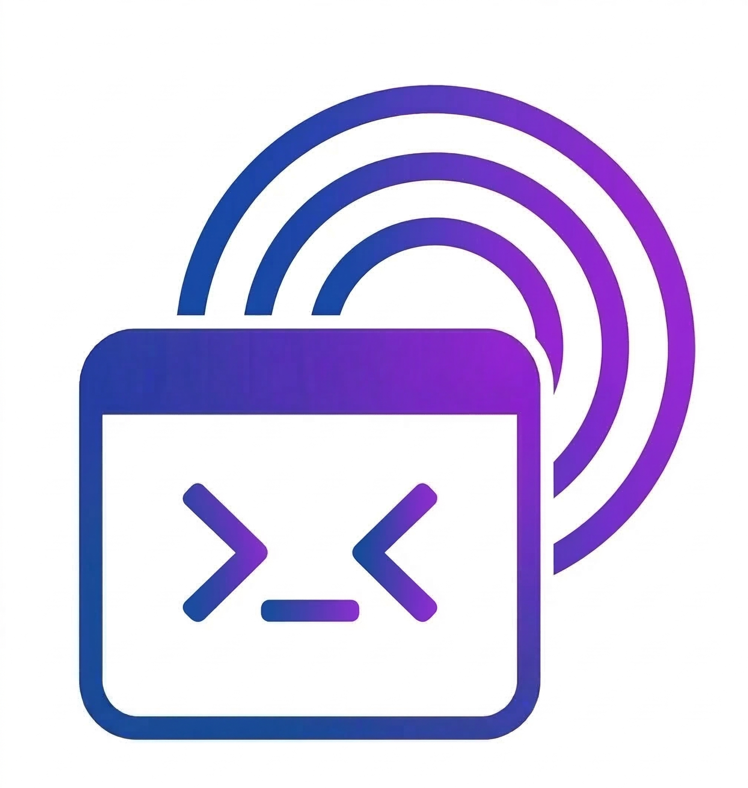

<p align="center">
  
</p>

<h1 align="center">Codecast</h1>

<p align="center">
  One bot to manage AI coding agents across all your machines
</p>

<p align="center">
  <a href="https://pypi.org/project/codecast/"></a>
  <a href="https://github.com/Chivier/codecast/actions"></a>
  <a href="https://chivier.github.io/codecast/"></a>
  <a href="https://github.com/Chivier/codecast/blob/main/LICENSE"></a>
  
</p>

---

Send a message from Discord, Telegram, or Lark. It reaches an AI coding agent on your GPU server, cloud VM, or any SSH-accessible machine — and streams the response back in real time.

## How is this different from the official Claude Discord bot?

The official Claude bot gives you a single conversation with Claude in the cloud. **Codecast** is fundamentally different:

| | Official Claude Bot | Codecast |
|---|---|---|
| **Where Claude runs** | Anthropic's cloud | Your own machines (GPU servers, VMs, dev boxes) |
| **Session management** | One conversation | Multiple persistent sessions across multiple machines |
| **Code access** | No file system access | Full access to your projects via Claude CLI |
| **AI backends** | Claude only | Claude, Codex (OpenAI), Gemini CLI, OpenCode |
| **Chat platforms** | Discord only | Discord, Telegram, Lark (Feishu) |
| **Multiplexing** | One bot = one conversation | One bot = many machines x many sessions |

Codecast turns your chat app into a **remote control panel** for AI coding agents running on your infrastructure.

## Architecture

```
You (Discord / Telegram / Lark)
 |
 v
+------------------+          SSH tunnel          +------------------+
|    Head Node     |  ----------------------->   |     Daemon       |
|    (Python)      |         JSON-RPC + SSE       |     (Rust)       |
|                  |                              |                  |
|  - Bot adapters  |    Can manage multiple       |  - Axum HTTP     |
|  - Engine        |    machines in parallel       |  - Session pool  |
|  - SSH tunnels   |                              |  - CLI adapters  |
+------------------+                              +--------+---------+
                                                           |
                                                    stdin/stdout
                                                           |
                                                  +--------v---------+
                                                  |   AI CLI Agent   |
                                                  |  Claude / Codex  |
                                                  | Gemini / OpenCode|
                                                  +------------------+
```

A single Head Node connects to any number of remote machines. Each machine runs a lightweight Rust daemon that manages AI CLI processes. Sessions persist across disconnects — detach from your phone, resume from your laptop.

## Quick Start

```bash
pip install codecast
cp config.example.yaml ~/.codecast/config.yaml
$EDITOR ~/.codecast/config.yaml   # add machines + bot token
codecast
```

Then open your chat app and type `/start my-server ~/projects/myapp`.

## Key Features

### Multi-Machine Session Management

Connect any number of servers. Each session has a human-friendly name (e.g., `bright-falcon`). Detach with `/exit`, resume with `/resume bright-falcon` from any device.

### Multiple AI Backends

Not just Claude. Start sessions with different AI CLIs:

```
/start my-server ~/project --cli codex
/start gpu-box ~/ml-project --cli gemini
/start dev-vm ~/webapp --cli claude
```

### Three Chat Platforms

- **Discord** — slash commands, autocomplete, interactive buttons
- **Telegram** — inline keyboards, file sharing, HTML formatting
- **Lark (Feishu)** — rich text messages, WebSocket connection

### Interactive Questions

When an AI agent asks you a question with options, Codecast presents it with native UI elements — buttons on Discord, inline keyboards on Telegram — so you can tap to respond instead of typing.

### Permission Modes

Control how much autonomy the AI agent has:

| Mode | Behavior |
|------|----------|
| `auto` | Full autonomy — no confirmations |
| `code` | Auto-accept file edits, confirm shell commands |
| `plan` | Read-only analysis |
| `ask` | Confirm every action |

### Real-Time Streaming

Responses stream back as the AI types. Choose how tool calls are displayed:
- **timer** (default) — clean "Working 5s" indicator, results sent at end
- **append** — see each tool call as it happens
- **batch** — summary of all tool calls at end

### SSH Security

The daemon binds to `127.0.0.1` only — never exposed to the internet. All communication goes through SSH tunnels. The daemon binary is auto-deployed to remote machines via SCP.

## Commands

| Command | What it does |
|---------|-------------|
| `/start <machine> <path>` | Start a new session (add `--cli codex` etc.) |
| `/resume <name>` | Resume a detached session |
| `/new` | New session, same directory |
| `/exit` | Detach (process keeps running) |
| `/stop` | Interrupt current operation |
| `/model <name>` | Switch AI model |
| `/mode <auto\|code\|plan\|ask>` | Switch permission mode |
| `/tool-display <timer\|append\|batch>` | Switch tool display mode |
| `/ls machine` | List machines |
| `/ls session` | List sessions |
| `/status` | Current session info |
| `/health` | Daemon health check |

See the [full command reference](https://chivier.github.io/codecast/commands.html) for all commands.

## Documentation

Full documentation: **[chivier.github.io/codecast](https://chivier.github.io/codecast/)** (English & Chinese)

| Guide | Description |
|-------|-------------|
| [Getting Started](https://chivier.github.io/codecast/getting-started.html) | Installation, first session walkthrough |
| [Configuration](https://chivier.github.io/codecast/configuration.html) | Config format, peers, bot tokens |
| [Commands](https://chivier.github.io/codecast/commands.html) | Every command with examples |
| [Architecture](https://chivier.github.io/codecast/architecture.html) | System design and internals |

## Requirements

- **Python 3.11+** — head node
- **SSH access** — to remote machine(s) with an AI CLI installed (Claude, Codex, Gemini, or OpenCode)
- **Bot token** — for Discord, Telegram, and/or Lark

The Rust daemon binary is auto-deployed. To build from source:

```bash
cargo build --release
# Binary: target/release/codecast-daemon
```

## License

MIT
