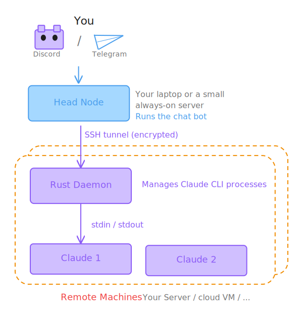

<p align="center">
  
</p>

<h1 align="center">Codecast</h1>

<p align="center">
  Control Claude CLI on remote machines from Discord & Telegram
</p>

<p align="center">
  <a href="https://pypi.org/project/codecast/"></a>
  <a href="https://github.com/Chivier/codecast/actions"></a>
  <a href="https://github.com/Chivier/codecast/blob/main/LICENSE"></a>
  
</p>

---

Send a message in Discord or Telegram. It reaches Claude CLI on your GPU server, your cloud VM, or any machine with SSH access — and streams the response back in real time.

## Why Codecast?

| Problem | Solution |
|---------|----------|
| Claude CLI only runs locally | Run it on any remote machine via SSH |
| Lose context when you close the terminal | Sessions persist — detach and resume anytime |
| Can't use Claude on mobile | Chat through Discord or Telegram from any device |
| Managing multiple dev machines is tedious | One bot, many machines — switch with a command |

## Architecture

<p align="center">
  
</p>

## Quick Start

**Prerequisites:** Python 3.11+, [Rust/cargo](https://rustup.rs/), SSH access to a remote machine with Claude CLI installed.

```bash
pip install codecast
```

**Configure:**

```bash
cp config.example.yaml ~/.codecast/config.yaml
$EDITOR ~/.codecast/config.yaml   # add machines + bot token
```

**Run:**

```bash
codecast
```

Then open Discord or Telegram and type `/start my-server ~/projects/myapp`.

## Key Features

- **Persistent sessions** — Claude CLI runs as a long-lived process; context survives across messages
- **SSH tunnels** — daemon binds to localhost only, never exposed to the internet
- **Detach & resume** — `/exit` keeps the session alive, `/resume` picks it back up
- **Multiple machines** — connect any number of servers, switch between them
- **Permission modes** — `auto` (full autonomy), `code` (auto-edit files), `plan` (read-only), `ask` (confirm everything)
- **Real-time streaming** — responses stream back via SSE as Claude types
- **Mobile-friendly** — works from any device with Discord or Telegram

## Commands

| Command | What it does |
|---------|-------------|
| `/start <machine> <path>` | Start a new Claude session |
| `/resume <name>` | Resume a detached session |
| `/new` | New session, same directory |
| `/clear` | Fresh context, same directory |
| `/exit` | Detach (process keeps running) |
| `/ls machine` | List machines |
| `/ls session` | List sessions |
| `/mode <auto\|code\|plan\|ask>` | Switch permission mode |
| `/status` | Current session info |
| `/health` | Daemon health check |

See [Commands Reference](./docs/commands-reference.md) for the full list.

## Documentation

| Guide | Description |
|-------|-------------|
| [Getting Started](./docs/getting-started.md) | Installation, first session walkthrough |
| [Adding a Discord Bot](./docs/adding-a-discord-bot.md) | Create a Discord Application step by step |
| [Adding a Telegram Bot](./docs/adding-a-telegram-bot.md) | Create a Telegram bot via BotFather |
| [Adding a Server](./docs/adding-a-server.md) | SSH config, jump hosts, password auth |
| [Commands Reference](./docs/commands-reference.md) | Every command with examples |

## Configuration

Config files are searched in order:
1. CLI argument: `codecast /path/to/config.yaml`
2. `~/.codecast/config.yaml`
3. `./config.yaml` (dev fallback)

## Requirements

- **Python 3.11+** — head node
- **Rust/cargo** — daemon binary is compiled during `pip install codecast` ([rustup.rs](https://rustup.rs/))
- **SSH access** — to remote machine(s) with Claude CLI installed
- **Bot token** — Discord and/or Telegram

## License

MIT
